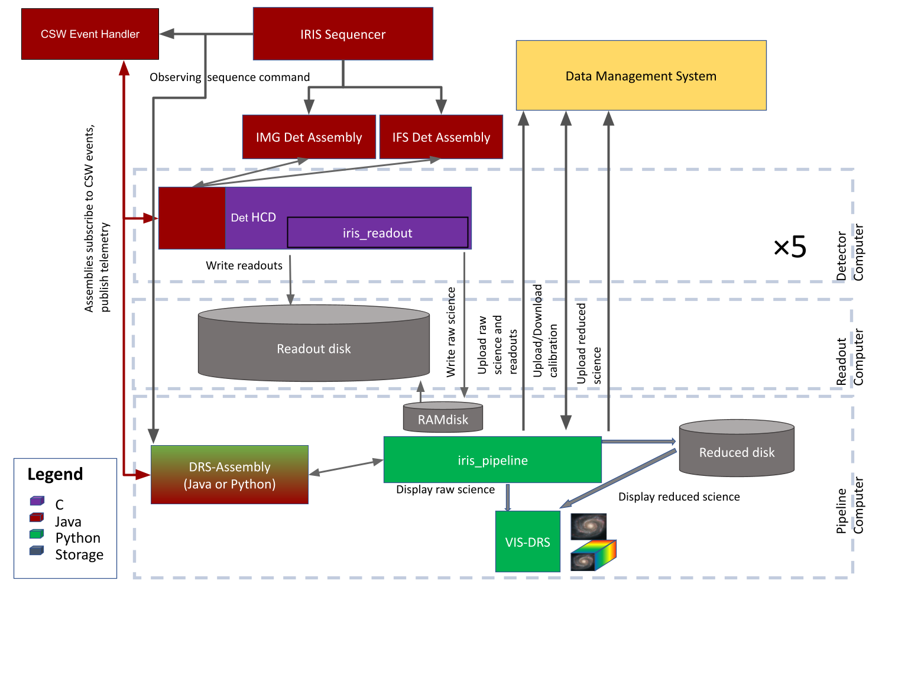

IRIS-TMT Data Reduction System Assembly
=======================================

The IRIS Data Reduction System (DRS) Assembly is a software component to be deployed at
the Thirty Meter Telescope observatory to manage the real-time reduction of IRIS data.
The role of the Assembly is to receive commands, gather telemetry, configure and launch
the data reduction pipeline implemented as a separate package: `iris_pipeline <https://github.com/oirlab/iris_pipeline>`_.

.. toctree::
   :maxdepth: 2
   :hidden:

Indices and tables
==================

* :ref:`genindex`
* :ref:`modindex`
* :ref:`search`
